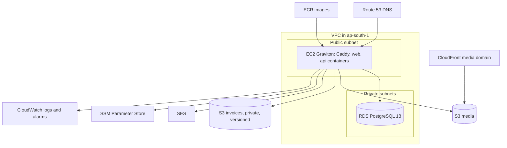

# Infrastructure

Parent: [high-level/](README.md) | Index: [docs/](../../README.md)

**Status: APPROVED design, 2026-09-13. Built in Phase 3 (staging) and Phase 6 (production).**
Account ids, resource ids and live DNS records are deliberately absent; they belong in the private operations reference described in [../../platform/runbook.md](../../platform/runbook.md).

## Environments

| Environment | Address | Deploys from | Purpose |
|---|---|---|---|
| Local | `localhost` through Docker Compose | your working tree | Development and `make ci`, with stubs for every vendor |
| Staging | `staging.polluxkart.com`, behind basic auth except webhooks, not indexed | every merge into `development` | A real domain for email, Google sign-in and Razorpay test webhooks; nightly end-to-end runs |
| Production | `polluxkart.com` | merges into `main`, after manual approval | The store |

Staging and production are built from the same Terraform module with different sizes.

## What one environment contains

| Resource | Setting and reason |
|---|---|
| EC2 | Graviton (ARM) for price; an Elastic IP; no SSH port, access through Systems Manager; automatic recovery if the host fails; set up by a cloud-init script so a replacement is identical |
| RDS PostgreSQL 18 | Private subnets only; encrypted; deletion protection; 14-day point-in-time restore; single availability zone while the app runs on one server |
| Backups | AWS Backup copies weekly snapshots to a second region |
| S3 media | Served only through CloudFront at the media domain; uploads through presigned requests |
| S3 invoices | Private, versioned, kept for the GST retention period; downloads only through an ownership-checked API endpoint |
| SES | Domain verified with DKIM, SPF and DMARC (email authentication records); bounces and complaints feed the suppression list |
| SSM Parameter Store | Every secret as an encrypted parameter, read at deploy time |
| CloudWatch | Container logs kept 30 days; alarms routed to the owner by email and SMS |
| Route 53 | DNS for the domain, plus health checks on the site and the API |
| Terraform state | An S3 bucket with state locking, created once by a bootstrap step |

## Deploy pipeline

1. A pull request runs `make ci` checks in GitHub Actions.
2. A merge into `development` builds the `api` and `web` images for ARM, tags them with the commit id, and pushes them to ECR.
3. GitHub signs in to AWS through OIDC (short-lived credentials; no stored keys) and asks Systems Manager to run `ops/deploy.sh` on the staging server.
4. The script writes the environment file from SSM, pulls the exact images, runs Flyway migrations as a one-shot container with the migration role, starts the new containers, waits for readiness, and runs a smoke test.
5. If readiness or the smoke test fails, it restarts the previous images automatically.
6. A merge into `main` repeats steps 3 to 5 on production with the images already proven on staging, after a manual approval in GitHub.

**Migrations are forward-only and backward-compatible:** a change is split into "add the new shape" and, in a later release, "remove the old shape", so the previous image still works if a rollback happens.

## Backups and restore

- Point-in-time restore on RDS for 14 days, plus weekly cross-region copies.
- `make restore-drill` restores to a new temporary database, runs checks (row counts, the latest order, invoice number continuity), records how long it took, and deletes the temporary database.
- The drill runs once before launch and every quarter after.

## Monitoring and alerts

| Alert | Why |
|---|---|
| API error rate above normal | Something is broken for shoppers |
| Webhook signature failures | A misconfigured secret, or someone forging payment events |
| Payments stuck for more than 30 minutes | Reconciliation is not keeping up |
| Site or API health check failing | The store is down |
| Database CPU, storage or connections high | Capacity trouble ahead |
| Server disk above 80% | Logs or images filling the disk |
| Monthly spend above budget | Cost surprise |

Error details with stack traces go to Sentry with personal data sending turned off.

## DNS and certificates

- Caddy obtains HTTPS certificates through a DNS challenge, so certificates exist before DNS points at a new server and there is no gap at cutover.
- CAA records restrict which certificate authorities may issue for the domain.
- Before launch, the DNS time-to-live is lowered a day ahead, then the apex and `www` records move from the maintenance CloudFront setup to the production server.

## Retiring the first version (2026-09-13)

The first version's backend server, its API DNS record and the old website files are being removed, with a disk snapshot kept briefly as a safety net.
The website bucket keeps old file versions for 30 days.
Exact resources and status are in the private operations reference.

## What is deliberately not done at launch

| Not yet | Trigger to add it |
|---|---|
| A second application server behind a load balancer | Sustained load a single server cannot handle, or a need for zero-downtime host maintenance |
| Database across two availability zones | Once the app itself runs on more than one server |
| A web application firewall in front of the site | Abuse or bot traffic the rate limits cannot absorb |
| Kubernetes or ECS | Several services running as separate programs |

## See also (do not follow recursively)

- [../../platform/cost.md](../../platform/cost.md) - what this costs
- [../../platform/security.md](../../platform/security.md) - secrets and access rules
