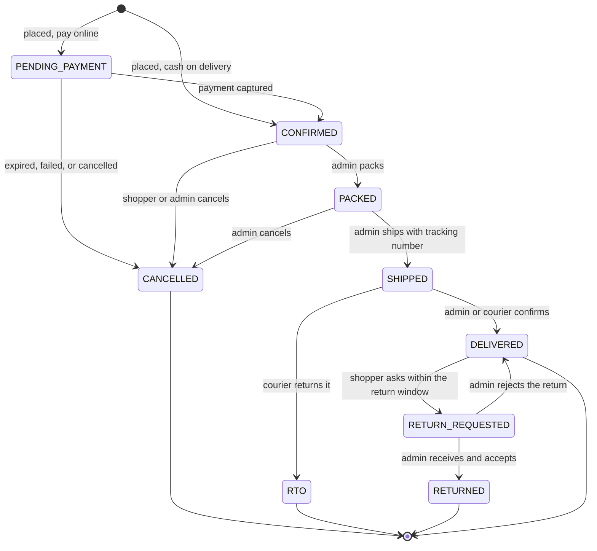

# Order lifecycle

Parent: [high-level/](README.md) | Index: [docs/](../../README.md)

**Status: PROPOSED (2026-09-13).** Written from the plan the owner approved on 2026-09-13. Owner decisions are marked in [decisions.md](../../platform/decisions.md); everything else here is confirmed or changed in its GitHub ticket before anything is built on it. Not built yet.

An order has two separate states:
- **Order status:** where the goods are in the process.
- **Payment status:** where the money is.

Every change goes through one transition table in the order service.
A transition not in the table is refused with `409 illegal_transition`.
Every accepted transition writes a row to `order_status_history` and an audit record, and publishes an event.

## Order status

## Transition table

| From | To | Who | Stock | Money | Invoice | Email |
|---|---|---|---|---|---|---|
| (new) | `PENDING_PAYMENT` | Shopper, online payment | Reserve, expires in 30 min | Razorpay order created | none | none yet |
| (new) | `CONFIRMED` | Shopper, cash on delivery | Reserve and commit | Payment status `COD_PENDING` | none | Order placed |
| `PENDING_PAYMENT` | `CONFIRMED` | System, verified payment | Commit reservation | `CAPTURED` | none | Payment confirmed |
| `PENDING_PAYMENT` | `CANCELLED` | System on expiry or failure; shopper | Release | `FAILED` or none | none | Cancelled, if the shopper had started paying |
| `CONFIRMED` | `PACKED` | Admin | none | none | none | none |
| `CONFIRMED` | `CANCELLED` | Shopper before packing; admin | Release | Refund if captured | none | Cancelled, refund started |
| `PACKED` | `CANCELLED` | Admin | Release | Refund if captured | none | Cancelled, refund started |
| `PACKED` | `SHIPPED` | Admin, with courier and tracking number | Sale: `on_hand` and `reserved` both decrease | none | **GST invoice issued** | Shipped, with tracking link and invoice |
| `SHIPPED` | `DELIVERED` | Admin, or courier update later | none | Cash on delivery: admin records `COD_COLLECTED` | none | Delivered |
| `SHIPPED` | `RTO` | Admin | Stock added back after quality check | Refund if captured | Credit note | Returned to sender, refund started if paid |
| `DELIVERED` | `RETURN_REQUESTED` | Shopper within the return window | none | none | none | Return request received |
| `RETURN_REQUESTED` | `RETURNED` | Admin on receiving the item | Stock added back after quality check | Refund | Credit note | Return accepted, refund started |
| `RETURN_REQUESTED` | `DELIVERED` | Admin rejects | none | none | none | Return declined, with the reason |

## Payment status

| Status | Meaning |
|---|---|
| `AWAITING` | Online payment not yet completed |
| `CAPTURED` | Razorpay confirmed the money is captured |
| `FAILED` | Payment failed or expired |
| `COD_PENDING` | Cash on delivery, not yet collected |
| `COD_COLLECTED` | Cash handed over by the courier and recorded by admin |
| `REFUND_PENDING` | Refund requested from Razorpay |
| `REFUNDED` | Refund confirmed |

## Rules that sit around the table

- **Expiry.** A scheduled job in the order service finds `PENDING_PAYMENT` orders past their payment hold, asks the payment service for the latest status (payment asks Razorpay), and only then confirms, or cancels and releases stock. inventory's own sweeper releases reservations that never got an order, after the hold time plus a grace period.
- **Late capture.** If payment reports a capture for an order that was already cancelled, order tries to re-reserve the stock and confirm; if the stock is gone, order asks payment to refund automatically and emails the shopper.
- **Retry payment.** While an order is `PENDING_PAYMENT`, the shopper can retry; each attempt is a new row in `payments` for the same order.
- **Refunds.** Before creating a refund, payment checks existing refunds for that payment, so a retried request cannot refund twice.
- **Cash on delivery limits.** Verified email, a maximum order value, a serviceable pincode and a cap on open cash on delivery orders per shopper.
- **Invoice timing.** GST requires the invoice when goods leave. order asks invoice for it just before saving `SHIPPED`; the call returns the same invoice if repeated, so a retry after a failure never creates a second number.
- **Credit notes.** Anything that reverses an invoiced order produces a credit note; invoices are never edited.
- **Idempotency.** Every transition request carries an idempotency key, so a double click performs it once.

## See also (do not follow recursively)

- [data-model.md](data-model.md) - the reservation and tax rules in detail
- [../../services/order/README.md](../../services/order/README.md) - the order service
