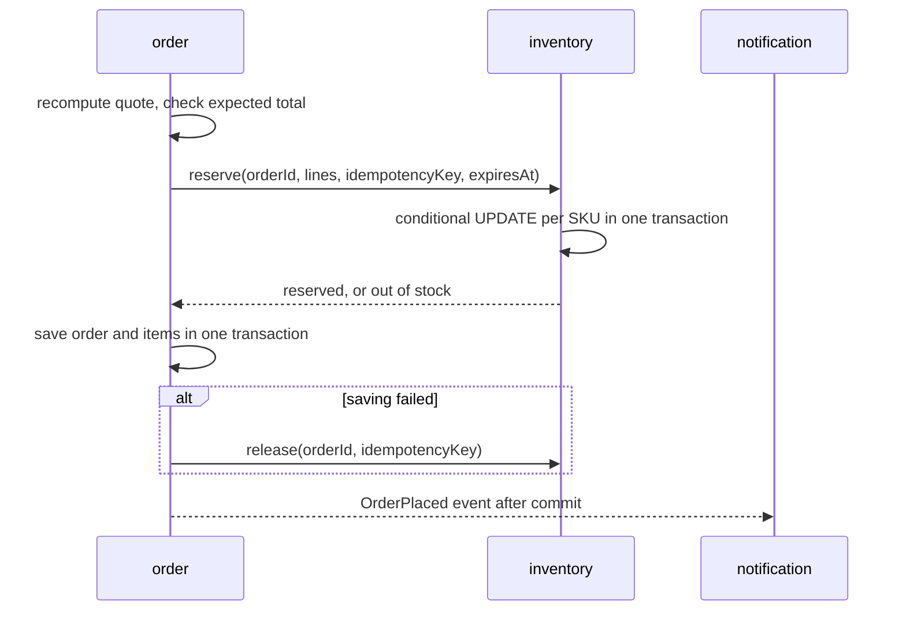

# Service boundaries: independent services in one codebase

Parent: [high-level/](README.md) | Index: [docs/](../../README.md)

**Status: APPROVED 2026-09-13 by the owner.**

## What was already decided before this document

- Backend in Java and Spring Boot on PostgreSQL (2026-09-13).
- One repository for frontend and backend (2026-09-13).
- **The owner rejected calling this a monolith (2026-09-13).** The services are microservices in design: independent, owning their data and contracts.
- **All services run in one process at launch, and split out one at a time later (owner's choice, 2026-09-13)**, over running as separate programs from day one or as a few grouped programs.

## Glossary for this page

- **In-process call:** one part of a running program calling another part directly, like a normal function call. Fast, and it cannot be lost on a network.
- **Adapter:** a small class that implements an interface by translating calls to something else, such as a network protocol.
- **Wire-safe:** data that can be turned into bytes, sent over a network and turned back without losing meaning.
- **Saga-style steps:** a business action split into steps that each commit on their own, with a compensating step to undo earlier ones if a later one fails.

## The idea in one paragraph

Every service is written as if it already ran on its own server.
It exposes a Java interface; other services call only that interface.
Today, Spring connects each interface to the in-process implementation, so calls are ordinary method calls.
When a service needs its own server, it gets a gRPC server in front of its implementation, and every caller gets a gRPC client adapter that implements the same interface.
A configuration switch decides which one is used, and no calling code changes.

## The services

identity, catalog, media, inventory, cart, order, payment, invoice, shipping, promotion, review, notification, audit.
What each owns is in [../../platform/architecture.md](../../platform/architecture.md) and in its own folder under [../../services/README.md](../../services/README.md).

## Rule 1: one Maven module per service, with a public and a private part

```
api/inventory/
  src/main/java/com/polluxkart/inventory/api/        public: InventoryApi interface, request and response records, error codes
  src/main/java/com/polluxkart/inventory/internal/   private: entities, repositories, logic, REST controllers, adapters
  src/main/resources/db/migration/inventory/         this service's schema only
```

- Another service may depend on `inventory`'s `api` package and nothing else.
- Maven refuses circular dependencies between modules, so two services can never depend on each other both ways.
- Spring Modulith's verification test and ArchUnit rules fail the build if anything imports another service's `internal` package.
- A tiny `shared-kernel` module holds only money in paise, id types and shared error code types; it holds no logic that belongs to a service.
- The `app` module wires every service into the single deployable and contains no business logic.

## Rule 2: contracts are wire-safe

A service interface may use only:
- Java records whose fields are strings, integer numbers, booleans, enums, lists, maps with string keys, other such records, and the shared-kernel value types.
- Typed results or error codes that map one-to-one to gRPC status codes later.

It may never use:
- JPA entities, lazy-loading proxies, `Optional` of an entity, streams, open database cursors, or framework types.
- Exceptions as the way to report business outcomes such as "out of stock"; those are typed results.
- Java object identity: a caller must not rely on getting back the same object it passed in.

A contract test sends every interface call through a serialize-and-deserialize round trip and checks the result is equal.
That test is what proves the gRPC swap will work.

## Rule 3: each service owns its data

- One PostgreSQL schema per service (`identity`, `catalog`, `media`, `inventory`, `cart`, `orders`, `payment`, `invoice`, `shipping`, `promotion`, `review`, `notification`, `audit`).
- A service's migrations create objects only in its own schema.
- A service never reads or writes another schema. There are no joins and no foreign keys across schemas; references across services are ids only.
- Data another service needs is either asked for through the interface or copied as a snapshot at the moment it matters (an order keeps a copy of the product name, price and tax rate it was sold at).
- Moving a service out later means moving its schema to its own database.

## Rule 4: calls are designed as if they were remote

- **Batch, never chatty.** `catalog.getSkus(List<SkuId>)`, not one call per item.
- **Idempotent mutations.** Every call that changes something carries an idempotency key, so a retry after a timeout does no harm.
- **No shared transaction.** A caller never relies on its database transaction covering work inside another service.
- **Bounded time.** Callers set a time limit even for in-process calls, so behaviour does not change when a network appears.
- **Queries at the edge.** Pages that need data from several services (a product page needs catalog, inventory and review) fetch it in parallel from the frontend's server side, rather than one service calling others on every read.

## Rule 5: side effects travel as events

- A service publishes events such as `OrderPlaced` or `InvoiceIssued` after its transaction commits.
- Spring Modulith's event publication registry stores each event in the database until every listener has handled it, so a restart cannot lose an email or an audit record.
- Listeners are idempotent, because an event can be delivered more than once.
- Later, the same events can be forwarded to a message broker such as Amazon SQS or Kafka when a service moves out.

## Rule 6: REST belongs to the service, and the browser only sees REST

- Each service owns its REST controllers under `/api/v1/...`.
- The frontend talks to the backend only over REST; gRPC is only for service-to-service calls after extraction.
- When a service moves to its own server, Caddy routes that service's paths to it.

## Placing an order across services

The one place independence costs something is the order and its stock, which cannot share a transaction.



- inventory's reservation is one conditional database update per SKU, so stock can never go below zero even with many buyers at once.
- If order cannot save after reserving, it releases the reservation.
- If the release call is lost too, the reservation expires at its `expiresAt` and a scheduled job releases it, after checking no payment arrived.
- Tests: 50 parallel buyers for the last 5 units produce exactly 5 orders; a crash injected between reserving and saving leaks no stock.

## When a service should actually move out

A service gets its own server only when one of these is true, and each move gets its own issue and design:

| Trigger | Likely first candidate |
|---|---|
| Product search needs a dedicated search engine, past about 5,000 SKUs | catalog search |
| Email and notification volume needs independent scaling or its own failure isolation | notification |
| A separate team takes ownership of a service | whichever they own |
| A service needs very different hardware, such as heavy PDF rendering | invoice |

## What this rules out

- A service importing another service's repository, entity or internal class.
- A SQL query touching two schemas.
- A single `@Transactional` method that calls into another service and expects both to roll back together.
- Returning entities from a service interface or a REST endpoint.

## See also (do not follow recursively)

- [data-model.md](data-model.md) - the tables inside each schema
- [order-lifecycle.md](order-lifecycle.md) - what happens after an order is placed
