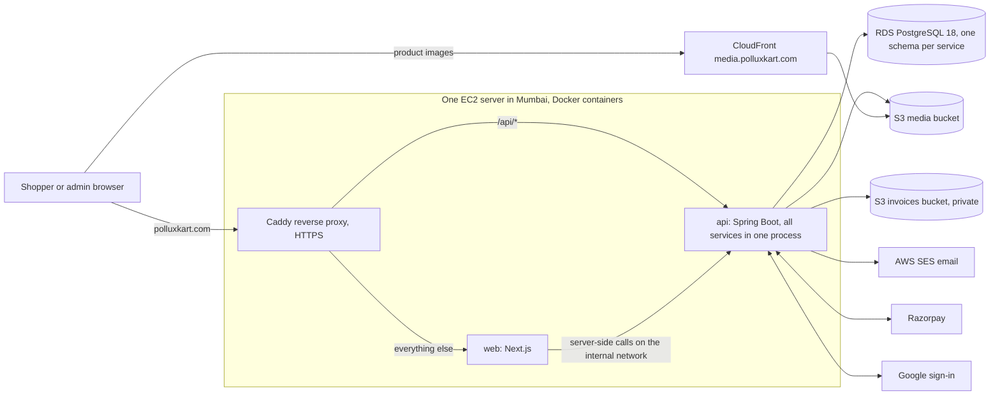

# Architecture

Parent: [platform/](README.md) | Index: [docs/](../README.md)

**Status: PLANNED, approved 2026-09-13. No code exists yet.**
This document describes the approved design.
When code lands and differs, the code wins and this document is fixed the same day.

## Glossary for this page

- **Service:** a self-contained part of the backend that owns one area of the business, such as inventory, with its own code module, database schema and interface.
- **Interface (Java):** a type that lists what a service can do without saying how. Other services call only this.
- **gRPC:** a framework for calling functions on another machine over the network. A service can move to its own server later by answering its interface over gRPC.
- **Schema (PostgreSQL):** a named namespace of tables inside one database, like a folder. Each service has its own.
- **Server-side rendering:** the server builds a page's HTML before sending it, so search engines and link previews see the real content.
- **Reverse proxy:** a web server in front of the apps that receives every request and forwards it to the right app.

## 1. The shape of the system



Two programs run behind one address:

- **web** (Next.js) renders every page. Catalog pages are built on the server and cached, so they are fast and show up well in search and WhatsApp previews. Cart, checkout, account and admin are rendered per request.
- **api** (Spring Boot) holds all backend services and is the only thing that touches the database, money, stock or vendors.

Because Caddy serves both under `polluxkart.com`, the browser sees one origin.
That removes cross-origin setup entirely and keeps the session cookie first-party.

## 2. Services: independent, in one codebase, deployed together at launch

**Decided 2026-09-13 by the owner.**
Each service is independent: its own Maven module, its own `api` interface, its own PostgreSQL schema, its own REST controllers.
At launch all services run in one process and call each other through their Java interfaces.
Any service can later run on its own server by swapping its interface implementation for a gRPC client, without changing the code that calls it.
The rules that make that swap real are in [../design/high-level/service-boundaries.md](../design/high-level/service-boundaries.md).

| Service | Owns | Schema | Publishes events |
|---|---|---|---|
| **identity** | Accounts, email verification, password reset, Google sign-in, sessions, addresses, admin two-step codes, consent records, data requests | `identity` | `UserRegistered`, `UserDisabled`, `AccountDeleted` |
| **catalog** | Categories and their specification fields, brands, products, SKUs (variants), specifications, search | `catalog` | `ProductPublished`, `ProductChanged`, `PriceChanged` |
| **media** | Image uploads to S3, file type checks, image records | `media` | `MediaFinalized` |
| **inventory** | Stock on hand and reserved per SKU, reservations with expiry, stock movements, pincode serviceability | `inventory` | `StockLow`, `ReservationExpired` |
| **cart** | Guest and signed-in carts, wishlist, cart merge on sign-in | `cart` | none |
| **order** | Checkout quote, the tax engine, orders and order items, the order state machine, idempotency keys | `orders` | `OrderPlaced`, `OrderConfirmed`, `OrderCancelled`, `OrderShipped`, `OrderDelivered` |
| **payment** | Razorpay orders and payments, webhook events, refunds, reconciliation | `payment` | `PaymentCaptured`, `PaymentFailed`, `RefundProcessed` |
| **invoice** | Store tax settings, GST invoices and credit notes, financial-year numbering, PDFs, GSTR-1 export | `invoice` | `InvoiceIssued` |
| **shipping** | Shipments, couriers, tracking numbers, the provider seam for Shiprocket later | `shipping` | `ShipmentUpdated` |
| **promotion** | Coupons, limits, redemptions | `promotion` | none |
| **review** | Verified-purchase reviews, moderation, rating summaries | `review` | `ReviewPublished` |
| **notification** | Email templates, the outbox, sending through SES, bounces and suppressions | `notification` | none |
| **audit** | Append-only record of every admin and security-relevant action | `audit` | none |

`orders` is used as the order schema name because `order` is a reserved word in SQL.

A tiny **shared-kernel** module holds only the types every service needs to agree on: money in paise, id types, error codes.
An **app** module wires every service into the single deployable and holds nothing else.

## 3. How requests flow

### A product page

1. The browser asks for `polluxkart.com/p/<slug>`.
2. Caddy forwards it to web.
3. web returns the cached HTML if it has it; otherwise it calls catalog, inventory (availability) and review (rating summary) through the API on the internal network, renders, and caches the page.
4. When an admin edits the product, catalog publishes `ProductChanged`, and the API asks web to drop the cached page by tag.

### Placing an order

1. The browser asks order for a quote. order reads the cart, current prices from catalog, the coupon from promotion, and delivery rules from inventory, then computes GST and the total.
2. The shopper confirms. The browser sends the order with an idempotency key (a unique id for this attempt, so a double click cannot create two orders) and the total it was shown.
3. order recomputes the quote. If the total changed, it refuses with `price_changed` and the new quote.
4. order asks inventory to reserve stock. inventory does it with one conditional database update per SKU, in its own transaction, with an expiry time.
5. order saves the order. If saving fails, order asks inventory to release the reservation; if that call is lost too, the reservation expires on its own.
6. order publishes `OrderPlaced`; notification sends the email.

### Paying with Razorpay

1. payment creates a Razorpay order for exactly the order's total and returns its id to the browser.
2. The shopper pays in Razorpay's checkout window.
3. The browser sends Razorpay's signed result; payment checks the signature, then asks Razorpay directly for the payment and confirms amount, currency and capture.
4. Separately, Razorpay's webhook arrives; payment checks its signature over the raw bytes and records the event id, so a repeat does nothing.
5. Whichever arrives first, the order ends in the same state: `CONFIRMED`, with the reservation committed.

### Shipping and invoicing

1. An admin marks the order packed, then shipped with courier and tracking number.
2. order moves the state; shipping records the shipment; inventory turns the reservation into a sale; invoice issues the GST invoice with the next number for the financial year.
3. notification emails the shopper with the tracking link and the invoice.

The full state machine is in [../design/high-level/order-lifecycle.md](../design/high-level/order-lifecycle.md).

## 4. API surface

REST over HTTPS, JSON, under `/api/v1`.
The OpenAPI document (a machine-readable description of every endpoint) is generated from the code and committed, and the frontend's typed client is generated from it.

| Group | Base path | Who can call |
|---|---|---|
| Health | `/api/v1/health` | Anyone |
| Auth and account | `/api/v1/auth/*`, `/api/v1/me/*` | Anyone for sign-up and sign-in; the signed-in owner for the rest |
| Catalog | `/api/v1/categories`, `/api/v1/products`, `/api/v1/brands`, `/api/v1/search` | Anyone |
| Delivery | `/api/v1/delivery-estimate` | Anyone |
| Cart and wishlist | `/api/v1/cart`, `/api/v1/wishlist` | Guest cart by cookie; wishlist signed in |
| Checkout and orders | `/api/v1/checkout/quote`, `/api/v1/orders` | Signed in, own orders only |
| Payments | `/api/v1/payments/*` | Signed in, own orders only |
| Webhooks | `/api/v1/webhooks/razorpay`, `/api/v1/webhooks/ses` | The vendor, verified by signature |
| Invoices | `/api/v1/orders/{number}/invoice` | Signed in, own orders only |
| Reviews | `/api/v1/products/{slug}/reviews` | Anyone reads; verified buyers write |
| Admin | `/api/v1/admin/**` | Admins with two-step sign-in only, enforced for the whole path |

Errors use one shape, RFC 9457 Problem Details, with a stable `code` the frontend reads.
Details: [security.md](security.md) and [../services/README.md](../services/README.md).

## 5. Planned code layout

```
api/                         Spring Boot, Maven multi-module
  shared-kernel/             money, ids, error codes
  identity/  catalog/  media/  inventory/  cart/  order/  payment/
  invoice/  shipping/  promotion/  review/  notification/  audit/
    src/main/java/com/polluxkart/<service>/api/        interface and records other services may use
    src/main/java/com/polluxkart/<service>/internal/   entities, repositories, logic, controllers
    src/main/resources/db/migration/<service>/         Flyway migrations for this schema
  app/                       the single deployable that wires every service
  openapi/openapi.json       generated, committed, checked for drift
web/                         Next.js App Router, TypeScript
  src/app/(store) (auth) (account) (legal) admin/
  src/lib/api/               generated types and the only code that calls the API
e2e/                         Playwright end-to-end tests and vendor stubs
infra/                       Terraform, Caddy, Docker Compose
ops/                         deploy scripts, maintenance page
tools/                       repository tooling such as docslint
```

## 6. How it deploys

- Two Docker images per commit: `api` and `web`, built for ARM (AWS Graviton) and stored in ECR (AWS's container registry).
- One EC2 server per environment runs Caddy, web and api with Docker Compose.
- Database migrations run once, as a separate one-shot container, before the new api starts.
- A merge into `development` deploys to staging automatically; a merge into `main` deploys the same images to production after manual approval.
- A failed health check after deploy rolls back to the previous images automatically.

Details: [../design/high-level/infrastructure.md](../design/high-level/infrastructure.md).

## See also (do not follow recursively)

- [../design/high-level/service-boundaries.md](../design/high-level/service-boundaries.md) - the rules that keep each service independent
- [../design/high-level/data-model.md](../design/high-level/data-model.md) - every table and constraint
- [stack.md](stack.md) - versions and why
